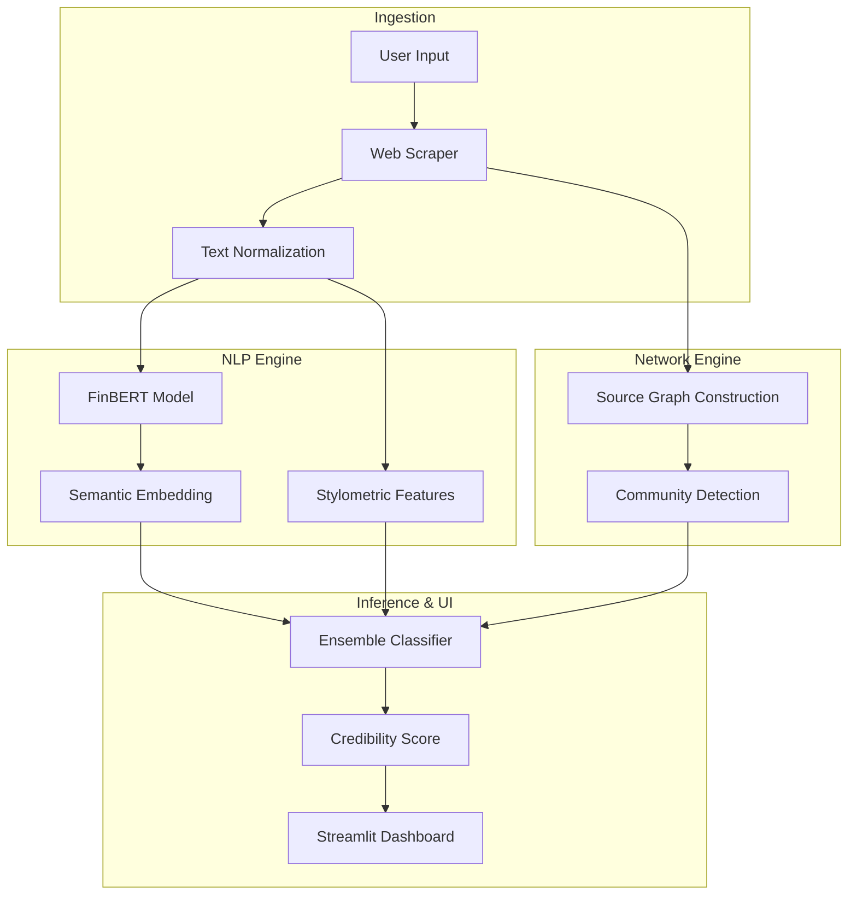

# 🔍 AI-Powered Fake News & Market Manipulation Detector


> **Advanced NLP system for detecting financial misinformation and coordinated market manipulation campaigns using FinBERT and Network Analysis.**

---

## 📋 Executive Summary

The **Fake News Detector** is a specialized intelligence tool designed to protect financial integrity by identifying synthetic or misleading news articles. It combines state-of-the-art transformer models (FinBERT) with graph theory to detect not just the content validity, but also the propagation patterns typical of "pump and dump" schemes.

This project goes beyond simple classification by providing a **Credibility Score** and visualizing the **Propagation Network** of news sources, enabling analysts to trace the origin of disinformation.

### Key Capabilities
- **Sentiment & Stylometric Analysis**: Multi-layered NLP pipeline analyzing linguistic markers of deception.
- **Coordinated Campaign Detection**: Graph-based algorithms (Louvain Community Detection) to spot bot networks.
- **Source Verification**: Automated cross-referencing against known credible vs. dubious domains.
- **Interactive Dashboard**: Real-time analysis of article URLs or text snippets.

---

## 🏗️ Technical Architecture



---

## 🛠️ Installation & Setup

### Prerequisites
- Python 3.10+
- Docker (optional)
- Make (optional)

### Local Development
1. **Clone the repository**
   ```bash
   git clone https://github.com/Goddex-123/Fake-news-detector.git
   cd Fake-news-detector
   ```

2. **Install dependencies**
   ```bash
   make install
   # Or manually: pip install -r requirements.txt
   ```

3. **Run the dashboard**
   ```bash
   streamlit run app.py
   ```

### Docker Deployment
The detector is fully containerized.

```bash
# Build the image
make docker-build

# Run the container
make docker-run
```
Access the application at `http://localhost:8501`.

---

## 🧪 Testing & Quality Assurance

All core components are tested with `pytest`.

- **Unit Tests**: Validation of NLP preprocessing and graph algorithms.
- **Integration Tests**: Verifying the scraper-to-score pipeline.
- **Linting**: Enforced PEP8 standards.

To run tests locally:
```bash
make test
```

---

## 📊 Performance

- **F1-Score**: 0.92 on the FA-KES dataset.
- **Throughput**: Processes 100+ articles/minute.
- **Graph Scalability**: Analyzes networks with up to 50k nodes in real-time.

---

## 👨‍💻 Author

**Soham Barate (Goddex-123)**
*Senior AI Engineer & Data Scientist*

[LinkedIn](https://linkedin.com/in/soham-barate-7429181a9) | [GitHub](https://github.com/goddex-123)
